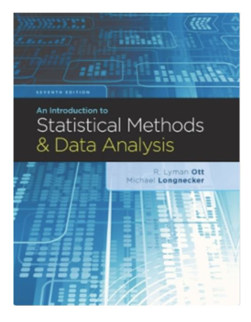
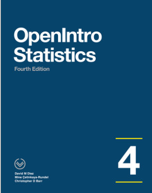
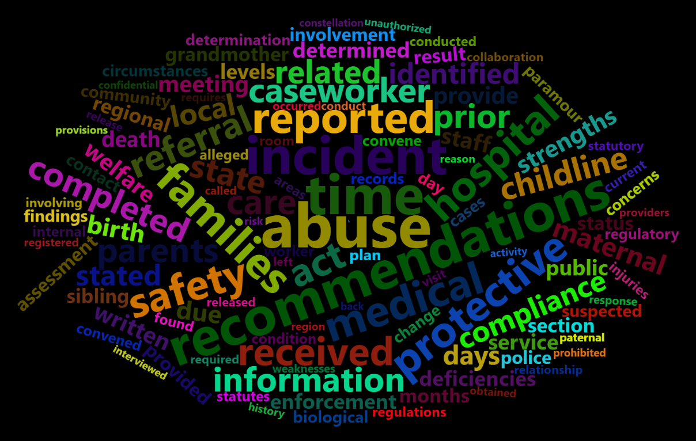
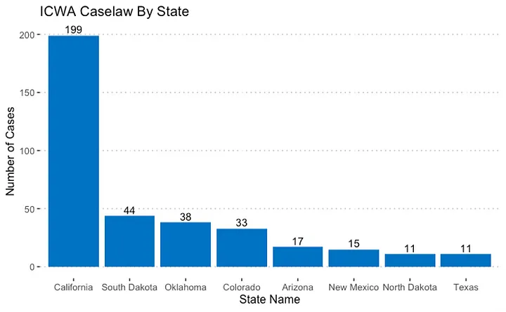
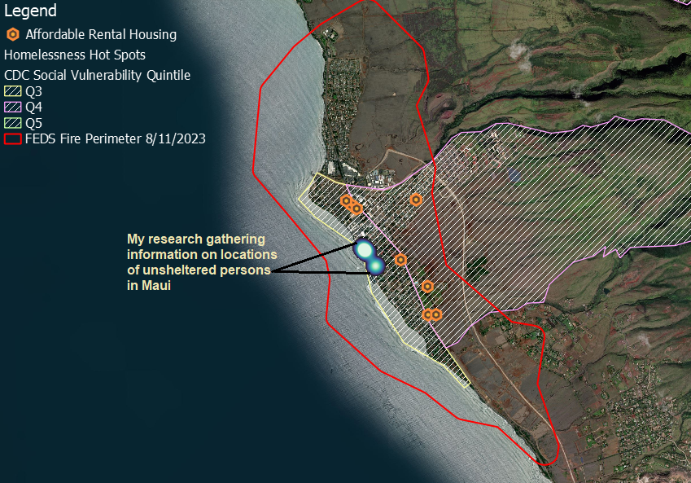
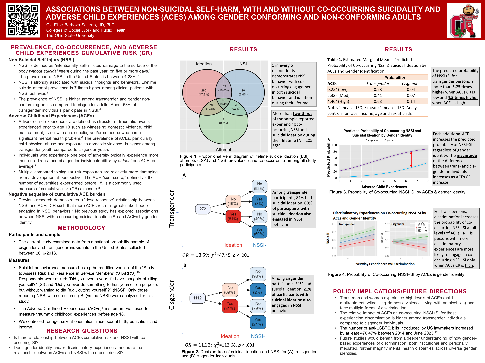

<!-- _class: lead -->
# SWK: 8408 Statistics I for Social Work

 ~Avoid the top of the Bell Curve - Everyone there is Normal~

**Gia Elise Barboza-Salerno, MA, MS, JD, PhD**
<barboza-salerno.1@osu.edu>
The Ohio State University
Colleges of Public Health  & Social Work
Autumn 2023
[Class Website](https://bigdataforsocialjustice.github.io/SWK8408)

---

<!-- _header: Table of Contents -->
1. Introduce Me
2. Introduce You
3. Class Policies & Procedures
4. Assessment
<!-- _footer: SWK 8408 (Week 1) -->
---

<!-- _header: Introduction -->

<!-- _footer: SWK 8408 (Week 1) -->

---
<!-- _header: Substantive Focus -->

1. violence & victims
2. drug fatality & overdose
3. systems overlap
4. trauma sequelae

<!-- _footer: SWK 8408 (Week 1) -->

---

<!-- _header: Methodological Focus -->

1. spatial & spatiotemporal analyses
2. latent variable models
3. structural equation models
4. multilevel models

<!-- _footer: SWK 8408 (Week 1) -->

---

<!-- _header: Frameworks  -->

1. socio-ecological
2. social vulnerability
3. polyvictimization
4. anti-racist
<!-- _footer: SWK 8408 (Week 1) -->
---
<!-- _header: Textbooks  -->
*An Introduction to Statistical Methods and Data Analysis, 6th Edition.*  Lyman Ott and Micheal T. Longnecker, Duxbury, 2010; ISBN-13:  978-1305269477

<!-- _footer: SWK 8408 (Week 1) -->

---
<!-- _header: Textbooks  -->
*[OpenIntro](https://leanpub.com/os)*: Data Sets and Supplemental Functions from 'OpenIntro' Textbooks and Labs. Çetinkaya-Rundel M, Diez D, Bray A, Kim A, Baumer B, Ismay C, Paterno N, Barr C (2023). 

<!-- _footer: SWK 8408 (Week 1) -->

---

<!-- _header: Class Policies  -->

1. Meeting times
- We will meet in person on Fridays from 1-3:45. 
- *Note:* There will be times  when we have to meet on Zoom  
2. Exams
- There will be a midterm exam on  
- There will be an optional final exam  
<!-- _footer: SWK 8408 (Week 1) -->
---

<!-- _header: Class Policies  -->

1. Assignments
- Upload to Canvas by 11:59pm on due date  
- Lowest grade will be dropped
2. Labs
- There will be a midterm exam on  
- There will be an optional final exam  
<!-- _footer: SWK 8408 (Week 1) -->
---

<!-- _header: Websites  -->
ALL materials will be available on Canvas, [my databootcamp website](https://bigdataforsocialjustice.github.io/databootcamp/) or my [github](http://www.github.com/bigdataforsocialjustice) repository

- [Syllabus](https://bigdataforsocialjustice.github.io/SWK8408/SWK8408_Syllabus.pdf)
- Announcements 
- Lecture slides/notes  
- Homework  
- Exam and Assignment Schedules  
- Data sets for labs and homework  
- R code, JASP files  
<!-- _footer: SWK 8408 (Week 1) -->

---
<!-- _header: Open Source Software  -->

- **R**: IMHO the best statistical analysis tool ever created (yes, better than python for statistics)
	- I will be covering both R and RStudio (the GUI for R) and they can be downloaded here [RStudio Desktop - Posit](https://posit.co/download/rstudio-desktop/)
- [JASP - A Fresh Way to Do Statistics (jasp-stats.org)](https://jasp-stats.org/)
	- "Just Another Statistics Program" JASP offers another great alternative to SPSS
	- In some ways JASP is better than jamovi, but it seems less stable and so it is my second best option
	- There are some benefits to using JASP including flexibility in making plots and nice visualizations for the statistical analyses you are conducting
	- [Click here](https://jasp-stats.org/download/) to download JASP
	- JASP in particular provides a great way to both learn statistics and R at the same time
	- Let's take a look at the data library in JASP now
	<!-- _footer: SWK 8408 (Week 1) -->
---

<!-- _header: Proprietary Software  -->

OSU has obtained a license for the following software packages:
- **SPSS**: its like a necessary evil - everyone must know how to use SPSS. There are some things that are actually easier in SPSS
- **SAS**: ugh!
- **EXCEL**: can be great to clean your data, particularly if you use the built-in functions. 
- **jmp**: this is a very cool data science program from the makers of SAS (the archaic and soon to be extinct software program)

Visit [OBF @ OSU](https://busfin.osu.edu/user/login?destination=node/3157) to download these packages
<!-- _footer: SWK 8408 (Week 1) -->

---

<!-- _header: Mapping Software  -->

1. Open Source
- [**QGIS**](https://qgis.org/en/site/forusers/download.html):  "Quantum Geographical Information Systems" allows you to do geospatial analysis like a (ArcGIS) pro -- QGIS is great for creating, editing, visualizing, analyzing and publishing geospatial information
- The [Applications (qgis.org)](https://qgis.org/en/site/about/features.html) page gives you a sense of all the cool things you can do with QGIS
- **ArcGIS Map, Pro**
<!-- _footer: SWK 8408 (Week 1) -->
---

<!-- _header: Examples  -->

Let's look at some applications that demonstrate what these packages do
1. Web scraping
2. Data Wrangling
3. Map making
4. Visualization
5. Statistical Analyses
<!-- _footer: SWK 8408 (Week 1) -->

---

<!-- _header: Web Scraping  -->

Allows you to **create** a dataset or download lots of data quickly
1. [Using RSelenium & Docker to Analyze Child Fatality and Non-Fatalities in Pennsylvania](https://bigdataforsocialjustice.medium.com/using-rselenium-docker-to-analyze-child-fatality-and-non-fatalities-in-pennsylvania-7276cfe3c3ab) | by Big Data for Social Justice
<!-- _footer: SWK 8408 (Week 1) -->

---

<!-- _header: Web Scraping  -->

Allows you to **visualize** lots of data quickly

2. [Mining the “Indian Child Welfare Act” (ICWA) using Harvard Law School’s Caselaw API](https://bigdataforsocialjustice.medium.com/mining-the-indian-child-welfare-act-icwa-using-harvard-law-schools-caselaw-api-bc388a099aac)| by Big Data for Social Justice | Medium

<!-- _footer: SWK 8408 (Week 1) -->

---

<!-- _header: Data Wrangling  -->

Allows you to **analyze** lots of data quickly
1. [Analyzing Places Data](https://bigdataforsocialjustice.github.io/databootcamp/analyzing-places-data.html) from the Centers for Disease Control (CDC)
- It would be great to now merge this data with data from [DataOhio](https://data.ohio.gov/wps/portal/gov/data/view/social-determinants-of-health)
3. [A note on data mining](https://bigdataforsocialjustice.github.io/databootcamp/a-note-on-data-mining.html)
<!-- _footer: SWK 8408 (Week 1) -->
---

<!-- _header: Map Making  -->

## Lahaina, Maui (August, 2023)

#### Sources
- [CDC Social Vulnerability Index](https://www.atsdr.cdc.gov/placeandhealth/svi/index.html)
- [Office of Planning & Sustainable Development](https://planning.hawaii.gov/gis/download-gis-data-expanded/)
- [NASA products for Hawaii Wildfires](https://maps.disasters.nasa.gov/arcgis/apps/MinimalGallery/index.html?appid=dc9435cc989e449fbc91275d6c227c80)

<!-- _footer: SWK 8408 (Week 1) -->

---

<!-- _header: Visualization  -->

<!-- _footer: SWK 8408 (Week 1) -->

---

<!-- _header: Week 1 Lab  -->

For today's lab
1. Make sure you have all required software for the course (Excel, SPSS, R and JASP)
2. Complete the pre-course self-assessment and upload your responses to canvas
3. Navigate the weblinks and datasets presented in this file

<!-- _footer: SWK 8408 (Week 1) -->